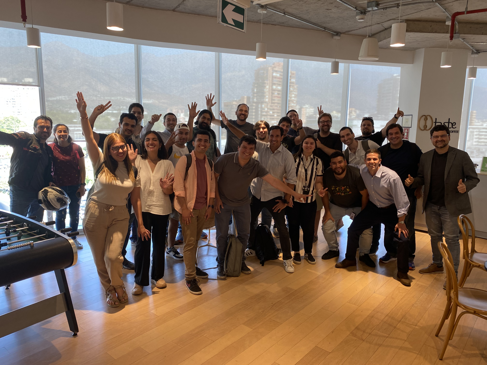

# Pie&AI

Pie & AI es una serie de reuniones de DeepLearning.AI organizadas de forma independiente por grupos comunitarios. Este evento es presentado por Andrés Wagner. ¡Un agradecimiento especial por su apoyo! Únete a nosotros para una reunión reveladora en la que profundizaremos en el mundo de las aplicaciones RAG (Recuperación-Generación Aumentada). Esta sesión está diseñada tanto para entusiastas como para profesionales que estén ansiosos por explorar la fascinante intersección de la recuperación de información y los modelos generativos de IA.

## Agenda del Evento
En este evento, comenzaremos presentando los conceptos centrales de la técnica RAG. Aprenderemos sobre su arquitectura, cómo integrar mecanismos de recuperación con modelos de lenguaje de última generación y por qué se está convirtiendo en un punto de inflexión en el campo de la inteligencia artificial y el aprendizaje automático.

Después de sentar las bases teóricas, cambiaremos nuestro enfoque a las aplicaciones prácticas. Compartiremos experiencias prácticas y cómo se han implementado con éxito sistemas RAG en distintas iniciativas. Es una oportunidad para conversar acerca de escenarios reales de aplicación, los desafíos que se enfrentan y las soluciones innovadoras ideadas para superarlos.

Esta sesión también incluirá un segmento de taller práctico. Aquí tendremos la oportunidad de trabajar en grupos pequeños o individualmente, para crear una aplicación RAG básica. Esta parte interactiva está diseñada para solidificar la comprensión de conceptos vistos anteriormente y entregar una idea de cómo crear un sistema RAG desde cero.

Finalmente, concluiremos con una sesión de preguntas y respuestas, dando espacio para discutir ideas, hacer preguntas y recibir comentarios de colegas y expertos en el campo.

Si eres nuevo en las aplicaciones RAG o busca profundizar tus conocimientos existentes, este evento es perfecto para aprender, compartir y conectarse con personas de ideas afines y apasionadas por el futuro de la IA. ¡Ven, sé parte de este viaje de aprendizaje y da tus primeros pasos para dominar las aplicaciones basadas en RAG!

Alentamos a todos los participantes a traer sus computadoras portátiles para el segmento práctico. Los conocimientos básicos de programación y conceptos de inteligencia artificial serán beneficiosos, pero no obligatorios. ¡Esperamos verte y adentrarnos en el apasionante mundo de las aplicaciones basadas en RAG!
Andres Wagner https://www.linkedin.com/in/andreswagner
______
Idioma: Español
Para estudiantes de todos los niveles
